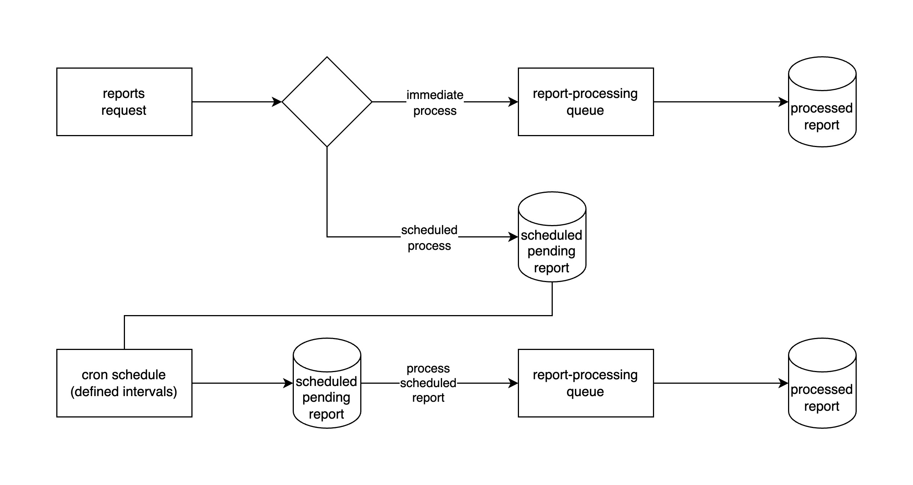

# REST API Report application

## Overview
This project is a RESTful API built using Hono, PgBoss, and Knex to manage report and schedule generation. The system allows users to request reports either immediately or on a schedule, processes them asynchronously using a queue, and provides status updates on requested reports.

## Setup Instructions
### Prerequisites
Ensure you have the following installed:
- Node.js (`>=v20.18.3`)
- Docker and Docker compose (`>=27.5.1`)

### Installation
1. Clone the repository:
   ```sh
   git clone git@github.com:abdulghani/knam-assignment.git
   cd knam-assignment
   ```
2. Install dependencies:
   ```sh
   npm install
   ```
3. Start the server:
   ```sh
   npm run dev
   ```

The API should be served in `http://localhost:3000` with the default `.env` provided.

### Cleanup

After you're finished using the API, if you need to cleanup docker image running, you can use `npm run cleanup` command.

## Design Choices

Following are the high level overview of the report processing for immediate and scheduled process with a queue



- Hono over Express, Identical API with additional helper packages for documentations.
- PgBoss for Job Queue, Ensures reliable scheduling and processing of reports.
- Knex for Database Access, Simplifies SQL queries and improves maintainability.
- TypeScript, Provides type safety and better code organization.
- Provided migration and initial seed data
- Report related route consolidated to single path `/report`
- Pending scheduled report is recorded in the database for the CRON job to retrieve, ensuring pending reports are persisted to process.
- Provided OpenAPI documentation in GET `/openapi` path
- Pino is used for logging, allowing real-time visibility into report processing as it occurs.
- The development database data is stored in a relative directory within the project, making it easy to clean up when needed.
- Use of Scalar UI to show the OpenAPI documentation in the root GET `/` path, can be used to send requests to the application.
- Define CRON process report interval with `REPORT_PROCESS_CRON` env, default to `* * * * *` (every minute)

Queue process are executed asynchronously without blocking API request, report processing and scheduled process are logged as it added to the queue/scheduled.


Project are provided with Scalar UI with OpenAPI document describing the API, you can use the interface to create and send the request to the application.


## Assumptions
- Reports are processed asynchronously and not immediately available.
- Cancellation only works before the report is processed.
- CRON schedule to process report run every minute to check report to process

## Future Improvements
- Implement authentication and authorization.
- Add route request validation
- Add unit and integration tests.
- Separate data access to a tested model repository
- Add the report generation process to the queue/schedule
- Add the report result to cloud storage or report entry

